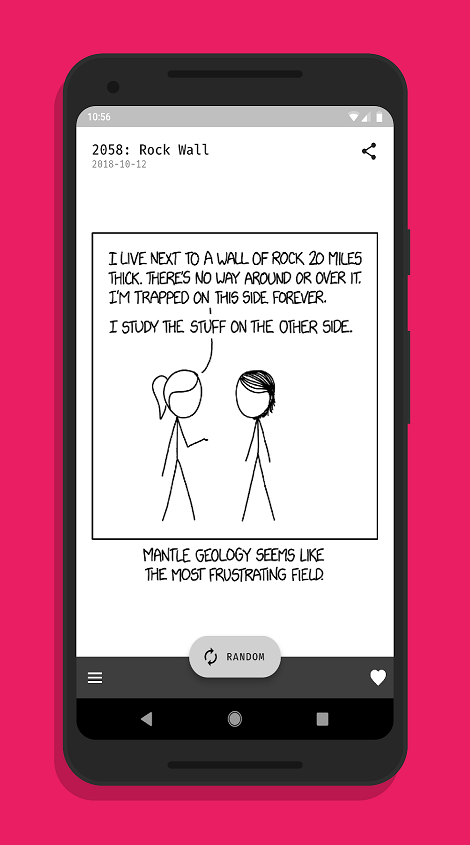
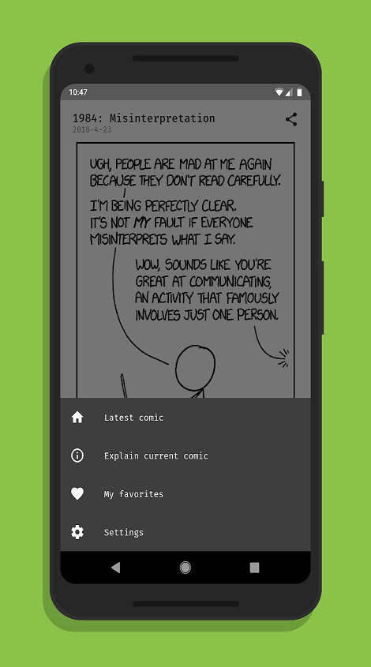
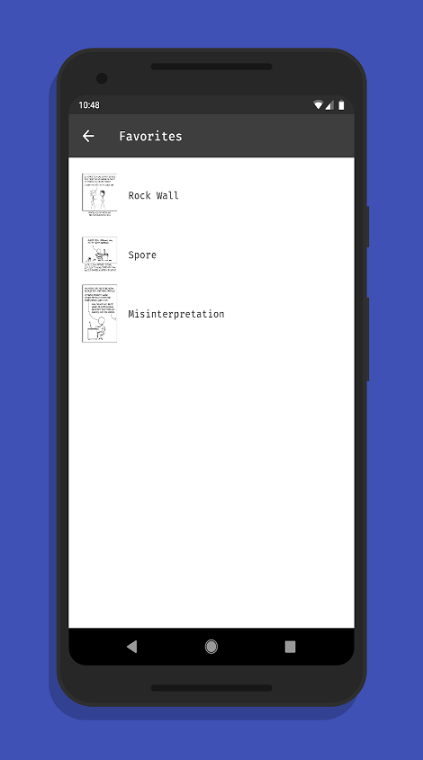

# xkcdViewer

xkcdViewer is a simple comic viewer for the infamous xkcd webcomic built with [Flutter 🐦](https://flutter.io/) and [ScopedModel](https://pub.dartlang.org/packages/scoped_model) for state management.

  

## Features:
- View the latest xkcd comic
- Browse for random comics
- Add comics to your favorites
- Long press on images to view the alt text
- Share comics via link
- Open an explanation of the current comic on explainxkcd.com
- Data saver option

Google Play and the Google Play logo are trademarks of Google LLC.

The comics displayed in this app are licensed under a Creative Commons Attribution-NonCommercial 2.5 License. Visit [xkcd](https://xkcd.com) for additional information.